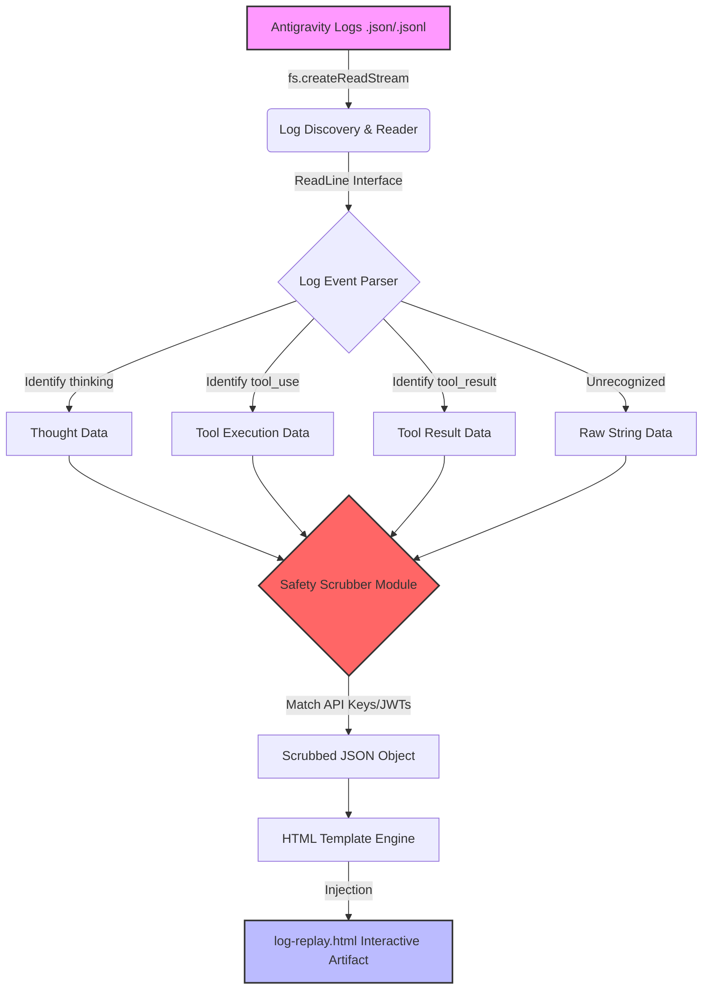

# G-Trace

[](https://github.com/Chit-ai/g-trace-skill/actions/workflows/g-trace-build.yml)
[](package.json)

**G-Trace** is a powerful logging and replay skill designed for the Antigravity Agent framework. It parses local Antigravity session logs, redacts sensitive information, and generates an interactive, dark-mode terminal HTML artifact for seamless debugging and review.

This documentation serves as the main entry point for both **users** running the analyzer and **developers** extending the parsing engine. 

---

## 🏗️ Technical Architecture

G-Trace is built on a streaming file architecture to handle potentially massive JSON/JSONL log files generated by long-running agent sessions.



### Component Breakdown
1. **Discovery Engine**: Finds the most recently modified `.json`, `.jsonl`, or `.log` file within the targeted directory if a specific file isn't provided.
2. **Streaming Parser**: Uses Node's `readline` module to process logs line-by-line, avoiding memory overloads on large files.
3. **Safety Scrubber**: A regex-based interceptor that sanitizes payload attributes matching credential patterns (e.g., `sk-...` keys and `eyJ...` JWTs) before they are serialized into HTML.
4. **HTML Generator**: A string-templated generator that outputs a self-contained, dependency-free HTML document stylized with vanilla CSS.

---

## 🚀 Detailed Implementation & Usage Steps

### Step 1: Clone the Skill into Antigravity
Antigravity automatically discovers skills placed in its `.agent/skills/` directory.

```bash
# Navigate to your Antigravity project root
cd /path/to/your/project/

# Ensure the skills directory exists
mkdir -p .agent/skills

# Clone the repository
git clone https://github.com/Chit-ai/g-trace-skill.git .agent/skills/g-trace
```

### Step 2: Agent Invocation
Once cloned, the agent will read the `SKILL.md` file. You can invoke it naturally in your conversation:
> *"Hey Antigravity, use the g-trace skill to analyze my last session logs and generate a replay."*

### Step 3: Manual Execution (CLI)
For developers who want to run the analyzer outside of an active agent session, you can run the Node logic engine directly.

```bash
cd .agent/skills/g-trace

# 1. Run against a specific file with redaction enabled (Recommended)
node index.js --path /path/to/logfile.jsonl --redact

# 2. Run against a directory (Automatically finds the newest log)
node index.js --path /path/to/logs/dir --redact --out my-custom-replay.html
```

#### CLI Arguments:
*   `--path <path>`: **(Required)** The file or directory containing the Antigravity logs.
*   `--redact`: **(Optional)** Enables the safety scrubber to mask API keys and JWTs.
*   `--out <path>`: **(Optional)** Specifies the output path for the HTML artifact. Defaults to `./log-replay.html` in the current working directory.

---

## 🔐 Security & Redaction

When the `--redact` flag is used, G-Trace traverses the entire JSON object of every log line and applies the `SECRET_REGEX` and `GENERIC_TOKEN_REGEX`. 

The core regex engine identifies:
*   Standard API Keys (matching `api_key=sk-...` or similar dictionary keys).
*   Standard JWT Tokens (Base64 encoded triplets like `eyJ...`).

To test the resilience of the redaction engine locally, we ship with a test script:
```bash
npm run test
```

---

## 🎨 Modifying the HTML UI

The UI is entirely self-contained within `index.js` inside the `generateHTML` function. 

If you wish to change the color scheme or layout:
1. Open `index.js`.
2. Locate the `const htmlHeader =...` string block.
3. Modify the CSS variables located within the `:root` pseudo-class (around Line 138):

```css
:root {
    --bg-color: #1e1e1e;          /* Background */
    --text-color: #d4d4d4;        /* Primary Text */
    --accent-color: #007acc;      /* Interactive Highlights */
    --thinking-color: #b5cea8;    /* Thought Block Green */
    --tool-color: #ce9178;        /* Tool Block Orange */
    --result-color: #4ec9b0;      /* Result Block Cyan */
}
```

---

## 📄 License & Publishing

This project is released under the **ISC License**.

It is automatically built and verified using a **GitHub Action Pipeline**, ensuring that every commit on `main` passes regex parsing tests and successfully generates a mock HTML artifact. Publishing to the Antigravity marketplace is seamlessly handled via `npm pack` automation.
